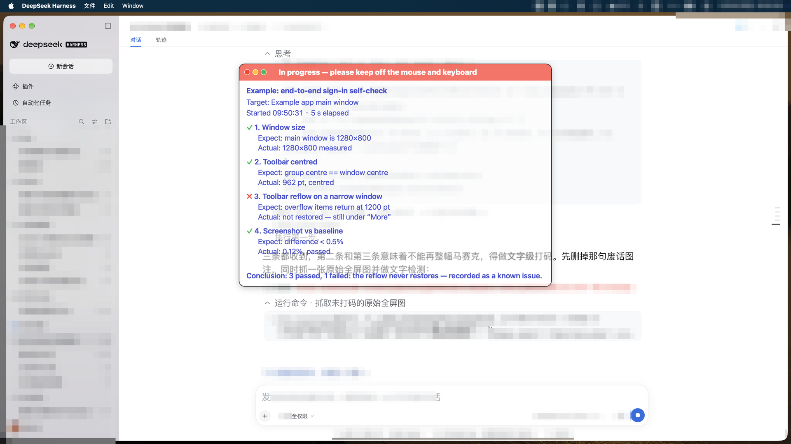

# dsh-testhud

An always-on-top, click-through progress panel for automated tests in [DeepSeek Harness](https://github.com/deepseek-ai) (dsh), drawn **over the app under test** — plus the `test_hud` tool that drives it from any session.



## Why it exists

When an agent drives a GUI, compares screenshots or renders a batch for a few minutes, the human just sits there: they cannot tell which step it is on, what the step expects, whether it already failed, or — the question that actually matters — **whether it is safe to touch the mouse and keyboard again**.

This panel answers exactly that, on screen, without stealing focus:

- **What is being tested** — title, target, start time and elapsed seconds.
- **Every step, with expectation and actual result** — one line each, ✓ / ✗ / ⏳ / •.
- **A permanent line about control, at the very top** — the panel's own strings are Chinese; this one reads `正在进行：先别动鼠标键盘，以免打断测试` while running and `✓ 已结束，可以收回鼠标键盘的控制权了` when done. It is the heaviest text on the panel and the only line carrying a background: **white on swatch red `#FF3B30` while it is unsafe to touch anything, black on swatch green `#34C759` once you may take over**. The text colour is picked **by state**, not by contrast — see the swatch section below.
- **It never gets in the way**: click-through (the mouse passes straight through), always on top, not in the Dock and not in ⌘Tab, and it picks the emptiest corner of the screen so it covers as little of the app under test as possible.
- **Move it by hand**: grab the top colour band and drag. The band is one of only two places that take the mouse (it is the drag handle); everything else stays click-through, and the content area takes the mouse only when content overflows — see "Size and overflow". **The cursor turns into an open hand over either place and a closed hand while you hold the button, then back on release** — the cursor shape itself is the "you can drag here" hint.
- **Three traffic lights at the band's left end**, the macOS three: **red** closes the panel, **yellow** collapses it down to just the band (click again to restore), **green** expands it to the usable-area ceiling — full height **and** full width (click again to go back to fitting the content; height alone often has no room left, since with enough content the natural height already equals the ceiling). Their colours are pinned to the swatch — red `#FF3B30`, yellow `#FFCC00`, green `#34C759` — each with a **1.0 pt white stroke**: the red dot and the red band are now the same swatch colour, so the stroke is the dot's only remaining cue.

## Install

```sh
dsh plugin --profile <profile> add link:/path/to/dsh-testhud   # from a checkout
dsh plugin --profile <profile> add dsh-testhud                 # from the registry
```

The Desktop app installs the same way (plugin settings); its plugin manager **mounts a new bundle live** — the row is composed immediately and the host is not restarted. A CLI-launched profile composes its bundle list at boot, so restart once unless your profile reloads patches live.

The package must actually be listed in the profile's `dsh.profile.bundles` (`dsh plugin add` does that for you); check that the row really entered the composition with `dsh --profile <profile> --dump-config` — it prints a `# == dsh-testhud` layer marker. Every session in that profile then has the `test_hud` tool and the short prompt convention about reporting long tests.

`@deepseek-ai/dsh-tools` is declared as a **peer dependency**: dsh resolves it to the running installation's copy (so the plugin always uses the host's own `defineTool`) and refuses the whole bundle when the running version falls outside the declared range, instead of half-loading it. The copy in `node_modules` is only a devDependency, for tests that run outside the host.

Uninstall:

```sh
dsh plugin --profile web remove dsh-testhud
```

## The agent tool

| `action` | What it does | Parameters |
| --- | --- | --- |
| `start` | Opens a run and launches the panel | `title` (required), `target`, `anchor` |
| `step` | Reports one check | `name` (required), `expect`, `actual`, `state` = `ok`/`fail`/`run`/`info` |
| `note` | Adds one line at the bottom | `text` |
| `done` | Writes the conclusion and ends the run | `failed` (boolean), `conclusion` |
| `stop` | Closes the panel immediately | — |

The panel sizes itself to its content in both directions (see "Size and overflow"), scrolls **only** the step list while the header stays fixed, and disappears 12 seconds after `done` — long enough to read the verdict.

## The rule

**If a verification is running, the panel must be up.** Never "just run the commands" without it: during a series of runs, `start` again after a `done` and before the next action. Whoever is waiting must be able to see what is being tested and whether it is safe to take back the keyboard.

**Clean up afterwards too**: `done` at the end, then **quit the app you launched for the test** (gracefully, not `kill -9`) and bring the browser / DSH window back to the front. Do not leave the app under test sitting on screen.

## The CLI

Same logic, same progress file, for shell scripts and CI:

```sh
testhud start "Movable toolbar layout" "Movable main window" [anchor]
testhud step  "toolbar is centred" "centre == window centre" "962pt, centred" ok
testhud note  "left to the user to decide"
testhud done  ok "3 of 3 checks passed"
testhud stop
testhud status
```

## Configuration

Optional row config in your profile's `cordis.patch.yml` overrides the plugin row:

```yaml
- id: testhud
  config:
    announceToAgent: true     # inject the short "report long tests on screen" convention into every session
    defaultAnchor: auto       # auto | center | left | right
    topInset: 155             # how far the top anchors drop below the screen top, in points
```

Where the panel goes is decided in this order:

1. **Do not cover the thing under test.** The panel scores three positions against the frontmost app's windows and takes the one that overlaps least. This outranks everything below.
2. **Centre of the screen**, when that blocks nothing.
3. Otherwise **the side** — left before right.

Vertically it always sits high: the top edge sits `topInset` points below the **screen top** (155 by default), the bottom edge stops above the status bar / Dock (`Look.bottomInset`, 44 pt). Horizontally it stays off the edges (`Look.sideInset`, 28 pt) so it cannot sit on a sidebar or a scrollbar. Anchors are `auto | center | left | right`; the old `top-left` / `top-right` names still map to `left` / `right`.

`topInset` exists because the panel usually floats **over a browser**: the top ~150 pt of the screen are the tab strip, the address bar and the bookmarks bar, and a panel there would cover them. The default (155) starts the panel just below that chrome — level with the page's own header. `0` degrades to "clear the menu bar, then keep a 14 pt screen margin". The value is measured **from the screen top** (positioning uses the full `frame`, not `visibleFrame`), so what you pass is what you get. `DSH_TESTHUD_TOP_INSET` overrides it for the CLI.

### Size and overflow

**Both dimensions follow the content** (`HUD.layout()`):

- **Width** is the widest line at its natural (unwrapped) width plus the left and right insets (`Look.inset`, 16 pt), clamped to a floor of **460 pt** (`Look.minWidth`) and a ceiling of the screen's usable width minus 28 pt on each side (`Look.sideInset`).
- **Height** follows the content, and is exactly the content height while it fits; the ceiling is the span from the panel's top edge (`topInset` below the screen top, 155 by default) down to the bottom of the usable area minus 44 pt (`Look.bottomInset`) — **no longer 62% of the screen height**. Yellow collapses the panel to just the band; green expands it to that ceiling **and** to the full usable width.

The height has a ceiling, so with enough content the upper part is pushed outside the visible area. The panel's content area then carries a transparent drag hit layer (the `ScrollHandle` window plus its `ScrollGrip` view): **press and pull downwards to bring the upper content back** (natural scroll direction), and on release it eases back to the bottom over **0.28 s ease-out** — "the last line returns to the bottom of the window". **The hit layer only exists when content is actually cut off** (its height is 0 otherwise), so a panel whose content fits stays fully click-through. The cursor shows an open hand over it and a closed hand while held, reverting on release. Observe it at `~/.dsh/dsh-testhud/scroll.json` (`scrollY` / `maxY` / `atBottom` / `panning` / `bouncing` / `cursor` — the last one because screenshots do not contain the mouse pointer, so the cursor can only be verified this way).

### Colours come from the Apple swatch only

**Every colour on the panel must exist in the Apple swatch** — the 22 colours on page 1 of the swatch (`Apple色板/1Apple配色色卡.key`, on this machine under `$HOME/PARA/8.Code/AIDoc/设计规范/`): 9 neutrals + 3 blues + 10 functional. The single source of truth in code is `ApplePalette` in `hud/testhud.swift`, all built in **sRGB** (`calibrated*` constructors shift the values).

**Chameleon V2 (2026-10-09)**: the panel's ground is **fully transparent** — no fill, no backdrop snapshot; only text and a hairline border remain. Whatever is underneath stays visible, and the panel's own text is kept legible on any backdrop by three things (stroke + shadow + colour):

| Part | Light appearance | Dark appearance |
|---|---|---|
| Panel ground | **translucent** (`alphaFloor` 0.50) | same |
| Border (1.0 pt, `Look.panelBorderWidth`) | black `#000000` | white `#FFFFFF` |
| Body (title / step name / conclusion / expect / actual — **one colour**) | **picked adaptively**, see below | same |
| Text shadow | off by default (`textShadowBlur = 0`) | same |
| ~~Text stroke~~ | off by default (`strokeWidthPercent = 0`) | same |
| Step marks | ✓ `#34C759` / ✗ `#FF3B30` / ⏳ `#FF9500` / • same as body | same |

**The body colour is picked adaptively** (`Theme.pickTextColor`, 2026-10-09) — the backdrop is classified into four cases, and within a case only one pairwise contrast comparison is made:

| Backdrop | Picked |
|---|---|
| **itself coloured** (site blue, warm orange, deep green…) | whichever of black/white contrasts more (a coloured candidate tends to blur into a same-hue backdrop) |
| **neutral but mid-luminance** (pure mid grey) | black/white (blue only reaches 2.5:1 on mid grey) |
| **neutral, bright** | the better-contrasting of Apple blue `#0071E3` and indigo `#5856D6` |
| **neutral, dark** | the better-contrasting of bright blue `#2997FF` and mint `#00C7BE` |

Across eight measured backdrops (white-with-black-text / black-with-white-text / pure white / pure black / mid grey / site blue / warm orange / deep green) it picks **indigo / mint / indigo / mint / black / black / black / white**, each confirmed legible by eye. Hierarchy no longer rides on grey levels: it is all font weight (one size, four weights).

**The shadow takes "the backdrop's pole"** (white in the light scheme, black in the dark one): it blends into the backdrop, and its job is to push the backdrop's own strokes out from under the panel's letters. **The stroke is off by default** (`strokeWidthPercent = 0`) — three variants were compared side by side: a stroke makes 18 pt glyphs look fat and grubby, whereas a pure shadow stays clean and reads just as well. The capability is kept (set a negative value to enable it).

The band ignores the light/dark split and follows the state: **running = red `#FF3B30` + white text**, **done = green `#34C759` + black text**; the band's opacity is **0.75**. The three traffic lights are swatch values too (red `#FF3B30`, yellow `#FFCC00`, green `#34C759`) with a 1.0 pt white stroke. **The band is the only opaque piece left.**

The step marks are `✓` / `✗` / `⏳` / `•` and **not** `✅` / `❌`: colour emoji ignore `foregroundColor` and paint colours of their own, outside the swatch, so the glyph had to change. By the same token, emoji the caller (an agent) writes into a step name, expect or actual are not governed by `ApplePalette`.

**Only one thing is still computed**: which appearance to use. It reads the **median** luminance of the sampled rectangle (not the mean — dense text lifts the mean, which made a dark backdrop with white text look "light" and produced black panel text). The threshold **0.60 is empirically calibrated**: what ScreenCaptureKit returns has been **tone-mapped** (measured: pure white 1.000 comes back as 0.886, the dark grey `#1D1D1F` at 0.106 comes back as 0.373), so comparing against the textbook 0.5 inverts the decision. The backdrop is sampled every 0.7 s — *the rectangle the panel is about to cover*, and only that rectangle, plus immediately whenever the frontmost app changes or the panel resizes or changes content.

Two earlier palettes remain in the source unused (`banner()` / `tinted()` / `textColor()`, plus the "translucent ground + backdrop snapshot" route); **ask the user before reviving them**.

## Visual design

The layout follows CRAP deliberately; keep these rules when you edit it:

- **Contrast** — colour carries two jobs: status (the band and the step marks) and the **body colour** (swatch blue, which is what separates the panel's text from a black/white backdrop — see the table above). Hierarchy rides on **four font weights**, never on a second size — every line is `Look.base` (18 pt).
- **Repetition** — one left edge for all content (`Look.inset`, 16 pt), and only three spacing values: 14 pt between groups, 10 pt between steps, 2–4 pt inside a step.
- **Alignment** — the banner spans the full panel width and its text indents back to the content edge; a step's expect/actual lines use a real `headIndent`, not spaces (spaces never line up in a proportional font).
- **Proximity** — header (title / target / timer), steps, and the conclusion are three groups: tight inside, loose between.

Every line is the same size — `Look.base` (18 pt) in `hud/testhud.swift` — and the hierarchy comes from weight alone (heavy for the control line, bold for the title and status, semibold for steps, regular for the expect/actual detail). The browser's DSH body text is `--dsh-content-font-size` (14 px by default, 12–17 settable); the panel sits above it because light text on a translucent dark panel reads smaller than black text on a page. Change `base` and the whole panel resizes with it. The other layout numbers: 16 pt padding (`Look.inset`), 14 pt corner radius (`Look.cornerRadius`), 1.0 pt border.

## Requirements

- **A dsh host that provides `@deepseek-ai/dsh-tools`** — declared as a peer (`~0.2.0-rc.2` at the time of writing), so `defineTool` is the host's own copy and a runtime outside the declared range is refused rather than half-loaded. The package has no other runtime dependencies.
- **macOS** for the panel itself (AppKit). The progress file and the tool work anywhere.
- **Xcode Command Line Tools** for `swiftc` — the panel is compiled on first use into `~/.dsh/dsh-testhud/bin/testhud` (3–4 s in practice on this machine) and reused afterwards, so the package ships source, not binaries. Without `swiftc` the tool still records every step and still returns the verdict; it just reports that it could not draw the panel.

## Development

### Inspect, don't guess

`bin/testhud-inspect.py` is the observation tool for the panel's pixels. It reads the geometry the panel itself exports on every layout (`~/.dsh/dsh-testhud/panel-frame.json`), crops exactly that rectangle, and reports the panel's internal texture plus every OCR line inside it that does **not** belong to the panel's own content.

Use it instead of reasoning about panel coordinates from a screenshot: the panel's position and size are dynamic, and inferring them from OCR output mistakes content from *outside* the panel for text bleeding through. Contrast is computed from colour clusters rather than extreme pixels, and anything measuring under 1.5:1 is reported as an out-of-frame artifact rather than a contrast figure.

**When several rounds in a row report "nothing changed", suspect the instrument before changing the subject again.** A pixel-identical result across rounds, or several genuinely different implementations all "failing" the same way, are signs that the instrument is broken — not the thing being measured.

### Test on a backdrop that contains text

Sample a backdrop with **real text** under it — a source file, a terminal full of output, a chat transcript. A solid area (blank page, empty terminal) cannot show the failure this panel exists to avoid: its own text fighting the text underneath, same size and similar colour, two layers of type in one place. A clean backdrop proves nothing about it.

```sh
# a throwaway profile, so your real one is untouched
dsh --profile hudtest --from-default-profile headless --dump-config > /dev/null
dsh plugin --profile hudtest add link:"$PWD"
dsh --profile hudtest --dump-config | grep -A2 testhud        # the row is composed
dsh --profile hudtest "call test_hud: start, step, done"      # a real session must see and call the tool
rm -rf ~/.dsh/profiles/hudtest                                # clean up
```

`node_modules/@deepseek-ai/dsh-tools` is only needed for standalone `node lib/index.js` smoke tests; inside a dsh process the host resolves it. It is not part of the published package.

## How it works

```
lib/index.js      Cordis host plugin: registers the test_hud tool + a system-prompt section
lib/hud.js        progress file (~/.dsh/test-progress.json) and the panel process (build / start / stop)
hud/testhud.swift the panel itself: borderless NSPanel at .screenSaver level, ignoresMouseEvents, polls the file every 0.4s
                  (plus two small transparent helper windows that cover one region each — the band handle and the
                   content drag hit layer: the panel is click-through as a whole, and ignoresMouseEvents is
                   per-window, so one window cannot be "click-through here, solid there")
bin/testhud.js    CLI over the same core
```

The progress file schema is deliberately plain JSON, so anything can write it:

```json
{ "title": "…", "target": "…", "status": "running|done|failed", "startedAt": 1789518613.07,
  "steps": [{ "name": "…", "expect": "…", "actual": "…", "state": "ok|fail|run|info" }], "note": "…" }
```

## Limitations

- **One panel per machine.** The progress file is a single well-known path, so two concurrent test runs share one panel — the last writer wins.
- The panel is click-through by design, with **two exceptions**: the top colour band (the drag handle — without it there would be no way to move the panel by hand) and, while content overflows, the content drag hit layer. A mouse landing on either grips the panel instead of the app underneath; `stop` / `done` make it go away.
- **The band's left 78 points are reserved for the three dots**; the band text starts after them, so a long status line cannot run into the dots.
- Dragging leaves the panel **wherever you put it** — `layout()` only keeps the top edge fixed when the height changes, it never snaps back to a candidate position — until the panel process restarts. The drag is clamped to the visible area of the screen the mouse is on: otherwise the panel can be dropped into the dead space between two displays, where nothing is visible and it can never be clicked again.
- On a screen already covered by full-screen windows, every corner overlaps something; `auto` then falls back to the top-left corner. Pass an explicit `anchor` to keep the panel away from the area you are testing.
- **In the worst case the panel's text competes with the backdrop's text**: over dense text (a terminal full of output, say) the two layers sit on top of each other. The answer is **a translucent ground plus an adaptive body colour**: the ground pushes the backdrop back one layer, and the body colour is picked for the backdrop (see "Colours"). To go fully transparent instead (text has to fend for itself): set `Look.transparentPanel` to `true` — only in that mode is the text shadow (`textShadowBlur`) worth turning on.
- **The panel's own strings are bilingual** (the control band, `测试对象：` / `Target:`, `期待：` / `Expect:`, `实际：` / `Actual:`, `结论：` / `Conclusion:`): English when the system's preferred language starts with `en`, otherwise Chinese; `DSH_TESTHUD_LANG=en` forces it (used for screenshots and tests). A run's title and step text are whatever the caller wrote.

## License

MIT
