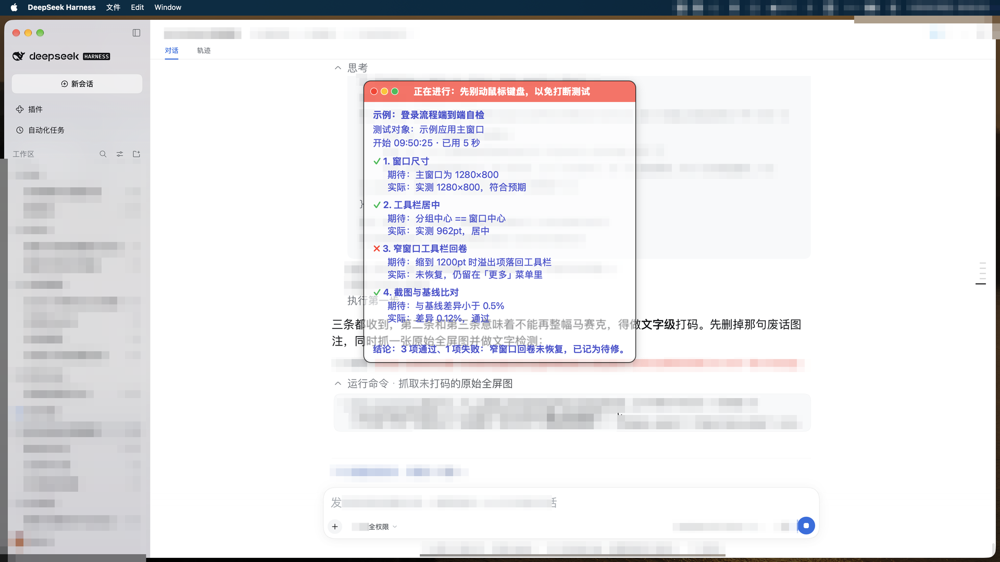

# dsh-testhud

把自动测试的进展**画在被测界面之上**的浮层：置顶、鼠标穿透、不抢焦点，配一个任何 session 都能直接调的 `test_hud` 工具。



## 为什么要有它

agent 驱动 GUI、比对截图、批量渲染，一跑就是几分钟。这段时间里等的人什么都不知道：跑到第几步、这一步期待什么、
是不是已经失败了，以及最要紧的那个问题——**现在能不能动鼠标键盘了**。

这块浮层就回答这些，画在屏幕上、不抢焦点：

- **在测什么**：标题、测试对象、开始时间与已用时。
- **每一步的期待与实际**：一行一条，✅ / ❌ / ⏳ / •
- **常驻第一行的控制权提示**：跑的时候「🖱️⌨️ 正在进行：先别动鼠标键盘」，结束「✅ 已结束，可以收回鼠标键盘的控制权了」。
  它是整块浮层里字重最重、也是唯一带底色的一行 —— **不能碰的时候是黄底黑字，可以接手了是绿底黑字**
（实心亮底，半透明暗面板上能拿到的最高对比）。
- **不碍事**：鼠标穿透、置顶、不进 Dock 也不进 ⌘Tab，并且自动挑屏幕上最空的角，尽量少盖住被测界面。

## 安装

```sh
dsh plugin --profile web add github:yijiezhong/dsh-testhud
```

新增的 bundle 行在启动时组合，所以**重启一次 profile**（插件市场里有重启按钮）。
之后该 profile 里的**每个 session** 都有 `test_hud` 工具，以及一小段"跑长测试要报进展"的系统提示约定。

卸载：

```sh
dsh plugin --profile web remove dsh-testhud
```

## agent 工具

| `action` | 作用 | 参数 |
| --- | --- | --- |
| `start` | 开一次测试并拉起浮层 | `title`（必填）、`target`、`anchor` |
| `step` | 上报一步 | `name`（必填）、`expect`、`actual`、`state` = `ok`/`fail`/`run`/`info` |
| `note` | 底部补一行说明 | `text` |
| `done` | 写结论、结束这次测试 | `failed`（布尔）、`conclusion` |
| `stop` | 立刻关掉浮层 | — |

浮层随内容长高（上限为屏幕可见高度的 62%），**只有步骤区滚动**、头部固定；`done` 之后再停 12 秒才消失，
够看清结论。

## 约定

**只要在做自动化验证就必须有浮层**：不许"只跑命令不起浮层"。连续几轮验证时，上一轮 `done` 之后、
开始下一个动作之前先重新 `start` —— 等待的人要能随时看到"现在在测什么、能不能接手"。

**收尾也一样重要**：结束时 `done`，然后**关掉为测试启动的那个 app**（优雅退出，别强杀），
并把浏览器 / DSH 界面切回前台 —— 不要被测 app 留在屏幕上挡着（用户明确要求）。

## 命令行

同一套逻辑、同一个进度文件，给 shell 脚本和 CI 用：

```sh
testhud start "Movable 工具栏布局自检" "Movable 主窗口" [anchor]
testhud step  "工具栏居中" "分组中心 == 窗口中心" "实测 962pt，居中" ok
testhud note  "剩下交给用户判断"
testhud done  ok "3 项检查全过"
testhud stop
testhud status
```

## 配置

在 profile 的 `cordis.patch.yml` 里按行 id 覆盖：

```yaml
- id: testhud
  config:
    announceToAgent: true     # 是否给每个 session 注入"长测试要报进展"的约定
    defaultAnchor: auto       # auto | top-left | top-right
    topInset: 155             # 上边两个角从屏幕顶部往下让出多少点
```

停哪儿按这个顺序决定：

1. **不挡被测对象**。面板拿三个位置去和**前台应用的窗口**比重叠面积，取最小的那个 —— 这一条压过下面所有规则。
2. **屏幕居中**（在居中不挡任何东西的前提下）。
3. 否则退到**侧边**，先左后右。

纵向一律靠上：顶边让开菜单栏与工具栏（`topInset`），底边停在状态栏 / Dock 之上（`Look.bottomInset`，44 pt），
高度上限同时受这两者约束。横向不贴边（`Look.sideInset`，28 pt），所以不会压住侧边栏或滚动条。
锚点是 `auto | center | left | right`；旧配置里的 `top-left` / `top-right` 仍然认，映射到 `left` / `right`。

`topInset` 是因为浮层通常**压在浏览器上**：屏幕最上面那 ~150 点是人家的标签栏、地址栏、收藏栏，
浮层贴在最上面会把这些盖住。默认 155 让浮层从浏览器 chrome 之下开始，与页面自己的头部齐平；
填 `0` 就是老行为（只留 14 点边距）。命令行可用环境变量 `DSH_TESTHUD_TOP_INSET` 覆盖。

**整套外观由一个数推出来。** 面板每 0.7 秒量一次**它即将盖住的那块矩形** —— 只量那一块 ——
拿到它的平均亮度和**明暗跨度**（p10~p90），另外在前台应用切换、面板尺寸变化、面板内容变化（防抖 0.5 秒）时立刻重采。
这几个数推出全部：面板底色与它的方向、**两级文字的亮度**、色带的底色与字色，以及面板底的不透明度、底图该压多平。
没有两套预设，只有一个公式 —— 面板上**没有任何一处颜色是写死的常量**。

诀窍在**方向**：面板要**顺着**背景走，不是逆着来 —— 浅背景配更**亮**的面板 + 深字，深背景配更**暗**的面板 + 白字。
方向反了（浅页面配深面板）只能靠不断加不透明度去救，而**那正是"被遮挡区域看不见"的根源**。

方向对了之后，还剩一个**物理上解不开**的取舍：面板里的字要读得出来，被挡住的东西也要看得见 ——
但包住面板文字的像素，同时就是遮住后方内容的像素，是同一批像素。两条路都试过，都留下了实测结论：
逐行压底板（用户否掉 —— 被遮挡区域后方的文字完全看不到了）；面板底尽量透（0.10 / 0.20 / 0.35 都试过，
密集文字背景上各会漏 1~3 行背景文字，而且漏的总是**刚打出来的内容**）。
最后取**下限 0.50**：普通背景上面板文字早已远超 AAA，被遮挡区域仍看得出明暗与形状 ——
但在铺满整屏的黑底白字上，这已经是"两者都要"能做到的极限。

**面板的底是"它所覆盖区域的一张模糊快照"** —— 与配色同一次采样拿到，σ=34 高斯模糊，饱和度压到 0.70。
全透的面板有它自己的失败模式：底下的文字依然清晰，和面板自己的文字**字号相近、颜色相近**，两层字叠在一处谁读都费劲。
把底糊掉之后，那层"竞争文字"化成柔和的光影：仍然看得出下面有东西，但不再抢读。

底图还有两件事必须做对，否则面板会**照着一个不存在的底**去配文字色（这个 bug 查了很久）：对比度是**围绕中灰**
压缩的，压完之后这张图的均值已经不等于采样均值（深色背景下能差一倍），所以要把均值**锚回**真实值 ——
而且这个真实值是**直接量出来的**（`CIAreaAverage` 渲染到 sRGB），不是推公式补偿的；
另外对比度按**明暗跨度**自适应，跨度大就压得更平 —— 底图保留的是大尺度明暗，而面板上的文字只有一个颜色，
一边亮一边暗时，无论配深字还是白字都会有一半失准。压平**不增加遮挡**（面板底的不透明度没动），
代价只是"下面有东西"的痕迹变淡。

对比度按 WCAG 那套（`(亮 + 0.05) / (暗 + 0.05)`）算，但**不解到刚好**：这个项目踩过的坑是
"纸面 7:1、屏幕实测只有 6.6~6.8"（中文笔画细，抗锯齿把实测亮度抬高了），所以"刚好够"的方案实测永远不够。

**文字的亮度是反解出来的**，不是常量：拿面板底的实际亮度解到 `primaryContrast`(9) / `secondaryContrast`(7)，
物理上解不出来就贴极端 —— 那个底给不出更多。二级的目标是「一级**实际**拿到的对比度 × 0.91」：
若两级各解各自的目标，暗面板上会双双贴到纯白，而层次是这块面板唯一的层级手段。

**文字的颜色也是，规则是「黑白优先」**：

1. **黑与白里谁给得多用谁** —— 比较两者对面板底各自的对比度，而不是按"面板亮还是暗"机械选。
   panelLum ≈ 0.19 那种地方，黑字（4.8:1）其实优于白字（4.38:1）。
2. **环境中性就用黑白灰**：饱和度低于 `minTintSat`(0.15) 时文字就是灰阶 —— 最干净，而且
   **黑与白是亮度区间的两个端点**，任何有彩色在同一亮度下都不可能比它们更极端。
3. **环境有颜色时，文字取它的互补色**（色轮对面 180°）。亮度**一点没变**，对比度分毫不差 ——
   换色相买到的不是"更清楚"，而是"面板文字与背景文字不同色"：背景有色时两层字往往同色，
   亮度对比已经拉满，能再分开两者的只剩下色相。
4. **亮度被夹到极端时**（说明这个底连目标对比度都给不出，黑白已经是它的极限），
   让出 `tintRelax`(0.05) 的亮度去换色相 —— 极端亮度下任何色相都解不出饱和度，等于没上色。

实测：一屏纯橙色背景（饱和度 0.727）→ 文字取 202° 互补青，面板最亮 2% 像素 `(218,239,251)`
的 R−B = −33，而背景的 R 明显大于 B；代价是白字从 5.24:1 退到 4.62:1。
色带走得更彻底 —— **它是全篇唯一还留着常量的地方，而那个常量只有色相**：琥珀 0.10 = 别动、
青绿 0.45 = 可以接手。（原来是黄 0.14 与绿 0.38，两者只隔 0.24，而黄与绿恰好是绿色盲最容易混淆的一对；
拉到 0.35 之后好分辨得多，而且青绿的 RGB 是 `(0, 1, 0.7)`，看着仍偏绿 —— "绿=可以走"的语义保住了。）

其余全部是算出来的：饱和度 `基准 × (1 − 0.5 × 环境饱和度)` —— 一条满饱和的带子压在彩色背景上是
视觉噪音而不是信息，环境有色时就降下来，环境中性时保持满饱和（那时它得独自承担全部辨识度）；
明度反解；不透明度钉在 0.55。

**带上的字直接用黑或白**，不做"解到刚好"的反解，也不上色 —— 带底的亮度本来就是被有意推到"够亮"的，
所以纯黑在这里永远可行、而且对比更高：实测带底呈现 0.445 时纯黑给 **9.90:1**，而"解到刚好"只有 6.50:1，
白亏 3.4:1。（把面板文字那套规则照搬到色带上是错的：面板底可能落在任何亮度，带底不会。）

实测：色带浅背景 **11.7:1**、深背景 **8.9:1**，两个场景都到 AAA。

实测：两个场景的背景都是**密集的真实文字**（不是纯色块 —— 纯色测不出这个浮层要避免的那种失败）。
数字由 `bin/testhud-inspect.py` 在浮层自己导出的几何上量：

| 背景 | 色带 | 标题 / 步骤名 | 期待 / 实际 | 测试对象 / 计时 |
|---|---|---|---|---|
| 浅背景（浏览器里的 DSH 界面，白底深字） | 6.6:1 | **9.4:1** | 7.2:1 | 7.2 / 7.2:1 |
| 深背景（终端，深底白字） | 5.8:1 | 7.7 / 7.0:1 | 5.9–6.7:1 | 6.5 / 6.8:1 |

18 pt 属于大字号，WCAG AAA 对大字号的要求是 4.5:1。浅背景下除色带外**全部达到 AAA 正文级的 7:1**；
深色密集文字是最坏情况，最低 5.8:1 —— 仍高过 AA 大字门槛，但到不了 AAA，这是 0.50 下限的代价。

采样按窗口号排除面板自己，所以它从不隐藏、也不闪。

## 视觉设计

版面是按 CRAP 定的规矩，改它的时候请守住：

- **Contrast（对比）**：颜色只承担一个语义 —— 状态。它只出现在两处：顶部通栏控制权色带，以及每个步骤行首的
  一个字符。其余层次全靠**两级灰度**（亮度由面板底反解，见上）与四档字重，绝不靠第二种字号 ——
  每一行都是 `Look.base`（18 pt）。浅底上不要放第三级灰：会掉到 3:1 以下，而且三级灰本来也难分辨。
- **Repetition（重复）**：所有内容贴同一条左边界（`Look.inset`），间距只有三个值：组间 14、步骤间 10、步骤内 2–4。
- **Alignment（对齐）**：色带通栏，文字用 `headIndent` 回到内容左边界；步骤的期待/实际用真正的 `headIndent`
  缩进而不是空格（比例字体下空格永远对不齐）。
- **Proximity（亲密性）**：头部（标题 / 测试对象 / 计时）、步骤、结论是三组，组内紧、组间松。

最差情况是**深色密集文字**（例如整屏终端输出），见上表：最低 5.8:1（色带），正文 5.9~6.7:1，标题 7.7:1。
色带是最弱的一项 —— 它按设计钉着 0.55 的不透明度（用户要求"能看到后面的文字"），
只能靠明度与字色去补，5.8:1 已经是这条色带在当前约束下的上限。

全部文字同号 —— `hud/testhud.swift` 里的 `Look.base`（18 pt），层次只靠字重：控制权提醒 heavy、标题与状态行
bold、步骤名 semibold、期待/实际 regular。浏览器里 DSH 的正文是 `--dsh-content-font-size`（默认 14 px，可设
12–17）；浮层比它大一档，因为半透明底上的浅色字比页面上的黑字显小。改 `base` 一个数，整块浮层跟着变。

## 依赖

- **一个提供 `@deepseek-ai/dsh-tools` 的 dsh 宿主**——0.1.x 的 harness 都可以。本包没有任何运行时依赖：
  `defineTool` 与 `ctx.*` 都由宿主提供。
- **浮层本体要 macOS**（AppKit）。进度文件与工具本身在哪都能用。
- **要 Xcode 命令行工具**（`swiftc`）：浮层在第一次使用时现编到 `~/.dsh/dsh-testhud/bin/testhud`（约一秒），
  之后复用——所以包里带的是源码，不是二进制。没有 `swiftc` 时工具照样记录每一步、照样给结论，
  只是如实告诉你"浮层没画出来"。

## 开发自测

### 先观测，不要猜

`bin/testhud-inspect.py` 是量这块浮层像素的观测工具。它读浮层每次布局时自己导出的几何
（`~/.dsh/dsh-testhud/panel-frame.json`），精确裁出那个矩形，报告面板内部的纹理，以及矩形内每一条
**不属于面板自己内容**的 OCR 行。

用它，不要凭截图反推面板坐标。这个项目有三条结论是错的，根因都是"面板矩形从 OCR 结果里倒推"，
而面板的位置和尺寸都是动态的 —— 每次都把面板**外面**的内容（终端的左半屏、浏览器标签页）当成了穿透文字。

它后来学会了两个陷阱，两个都先在数字上骗过人：

- OCR 的行框**可能伸进它并不属于的色块**。色带那一行的框比色带底边多出 20 px，于是面板自己的深色底被当成
  "文字色"，真实的 5.3:1 被报成 2.1:1。现在对比度按**颜色簇**投票算，不再取极端像素。
- `belongs()` 的 3-gram 规则会把只跟面板共享一小段片段的背景行认成面板自己的（实测是一条含 `dsh-testhud`
  的路径）。所以现在低于 1.5:1 的行一律报成"行框跨界的伪影" —— 文字和底几乎同色在物理上不会发生。

### 背景里必须有文字

采样用的背景要**真的有文字** —— 一份源码、一屏终端输出、一屏聊天记录都行。纯色区域（空白页、空终端）测不出
这个浮层要避免的那种失败：它自己的文字和底下的文字**字号相近、颜色相近**，两层字叠在一处。干净的背景证明不了
任何事。

```sh
# 用一个一次性 profile 验，别动你日常那个
dsh --profile hudtest --from-default-profile headless --dump-config > /dev/null
dsh plugin --profile hudtest add link:"$PWD"
dsh --profile hudtest --dump-config | grep -A2 testhud        # 行进了组合
dsh --profile hudtest "调用 test_hud：start / step / done"     # 真实 session 必须看得见并调得动这个工具
rm -rf ~/.dsh/profiles/hudtest                                # 收尾
```

`node_modules/@deepseek-ai/dsh-tools` 只在脱离 dsh 单独 `node lib/index.js` 冒烟测试时需要；在 dsh 进程里由宿主解析。
它不在发布内容里。

## 实现

```
lib/index.js      Cordis 宿主插件：注册 test_hud 工具 + 一段系统提示分区
lib/hud.js        进度文件（~/.dsh/test-progress.json）与浮层进程（编译 / 启动 / 停止）
hud/testhud.swift 浮层本体：无边框 NSPanel、.screenSaver 层级、鼠标穿透，每 0.4 秒读一次进度文件
bin/testhud.js    同一套核心的命令行
```

进度文件就是朴素 JSON，谁都能写：

```json
{ "title": "…", "target": "…", "status": "running|done|failed", "startedAt": 1789518613.07,
  "steps": [{ "name": "…", "expect": "…", "actual": "…", "state": "ok|fail|run|info" }], "note": "…" }
```

## 限制

- **一台机器一块浮层**：进度文件是固定路径，两场测试同时跑会共用一块浮层，后写的覆盖先写的。
- 浮层按设计鼠标穿透，所以不能用鼠标拖动或关闭：要挪位置用 `anchor`，要它消失用 `stop` / `done`。
- 屏幕被全屏窗口占满时，四个角都压着东西，`auto` 会退到左上角；想让开正在测的区域就显式传 `anchor`。
- **最坏情况下面板文字会变弱**：背景是密集的深色文字时（例如整屏终端输出），面板自己的文字落到 3.7~5.0:1。
  这不是一个还能继续调的参数：要完全压住 ~15:1 的高对比底层，面板底得实到 0.8 以上 —— 那就等于不透明，
  直接推翻"被遮挡的区域要看得见"。0.50 就是这两者之间的取舍点。

## 许可

MIT
